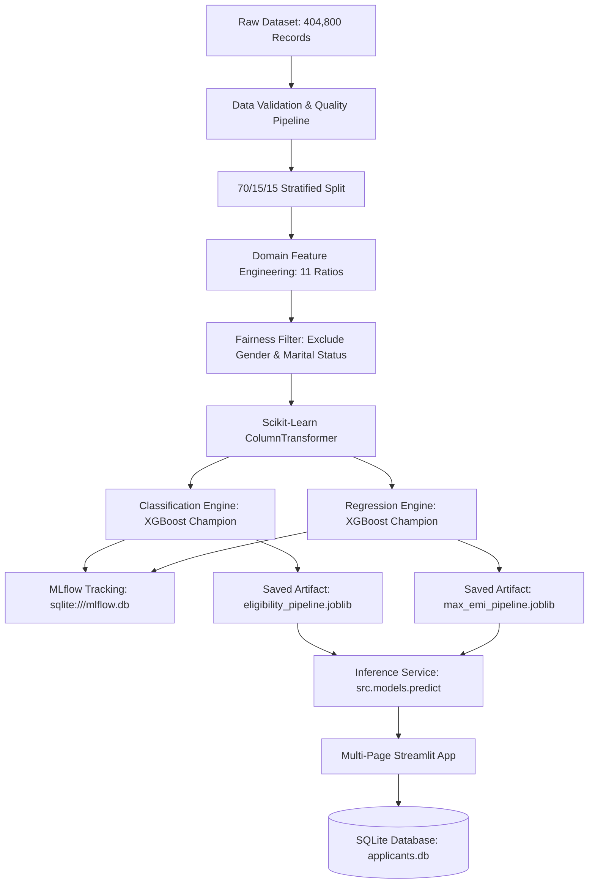

# EMIPredict AI — Intelligent Financial Risk Assessment Platform

[](https://www.python.org/downloads/release/python-3110/)
[](https://opensource.org/licenses/MIT)
[](https://github.com/astral-sh/ruff)
[](https://mlflow.org/)
[](https://streamlit.io/)

> **EMIPredict AI** is an intelligent, production-grade financial underwriting and risk assessment platform designed to evaluate loan applicants across multiclass risk categories and accurately estimate maximum safe monthly repayment capacity (**max_monthly_emi**).

---

## 1. Problem Statement & Business Context

In consumer credit underwriting, retail banks and Non-Banking Financial Companies (NBFCs) face two fundamental risk-assessment challenges:
1. **Underwriting Eligibility & Default Risk**: Assessing whether an applicant is creditworthy (`Eligible`), borderline volatile (`High_Risk`), or prone to immediate default (`Not_Eligible`).
2. **Affordability & Debt Capacity**: Quantifying the precise maximum monthly installment (`max_monthly_emi`) an applicant can comfortably service without causing severe debt-to-income (DTI) distress.

**EMIPredict AI** solves these dual challenges by deploying decoupled, high-performance machine learning models integrated with domain-specific feature engineering, MLflow experiment tracking, SQLite persistence, and an interactive Streamlit application.

---

## 2. Platform Architecture



---

## 3. Dataset & Schema Specifications

The production dataset (`data/raw/EMI_dataset.csv`) contains **404,800 records** across **27 columns** (25 input attributes + 2 target attributes).

### Feature Breakdown
| Category | Variables | Description |
| :--- | :--- | :--- |
| **Demographics** | `age`, `gender`, `marital_status`, `education` | Applicant demographic background (*`gender` and `marital_status` audited for fairness and excluded from decision models*). |
| **Employment & Income** | `monthly_salary`, `employment_type`, `years_of_employment`, `company_type` | Career stability, employer tier, and primary income. |
| **Living & Household** | `house_type`, `monthly_rent`, `family_size`, `dependents` | Housing overhead, family obligations, and cost of living. |
| **Monthly Expenses** | `school_fees`, `college_fees`, `travel_expenses`, `groceries_utilities`, `other_monthly_expenses` | Discretionary and fixed recurring monthly expenses. |
| **Credit & Assets** | `existing_loans`, `current_emi_amount`, `credit_score`, `bank_balance`, `emergency_fund` | Credit bureau score, existing loan liabilities, and liquid reserves. |
| **Loan Request** | `emi_scenario`, `requested_amount`, `requested_tenure` | Target financing scenario, loan amount, and tenure in months. |
| **Targets** | `emi_eligibility`, `max_monthly_emi` | Target classification class and continuous maximum monthly repayment capacity (₹). |

### Dataset Discrepancy Analysis
* **Prompt Note**: The brief noted a potential discrepancy between 22 and 25 input variables.
* **Empirical Verification**: Exact inspection of `data/raw/EMI_dataset.csv` verifies **25 input features + 2 target variables = 27 total columns**.
* **Data Sanitization**: Automatically repaired 1,993 string formatting anomalies (e.g. `64300.0.0` artifact converted to `64300.0` float).

---

## 4. Domain Feature Engineering

The platform calculates 13 domain financial metrics with strict zero-division safeguards (`ε = 1e-5`):
1. `total_monthly_expenses`: Sum of living overheads (`rent + school + college + travel + groceries + other`).
2. `total_monthly_obligations`: Total living expenses + current active EMIs.
3. `disposable_income`: `monthly_salary - total_monthly_obligations`.
4. `debt_to_income_ratio` / `current_debt_to_income_ratio`: `current_emi_amount / (monthly_salary + ε)` (*Debt-only ratio, distinct from living expenses*).
5. `expense_to_income_ratio`: `total_monthly_expenses / (monthly_salary + ε)` (*Living overhead relative to gross income*).
6. `obligation_to_income_ratio`: `total_monthly_obligations / (monthly_salary + ε)` (*Total obligations including expenses and debt*).
7. `savings_to_income_ratio`: `(bank_balance + emergency_fund) / (annual_salary + ε)`.
8. `emergency_fund_months`: `emergency_fund / (total_monthly_expenses + ε)`.
9. `requested_principal_per_month`: Principal-only monthly estimate `requested_amount / max(requested_tenure, 1)` (*interest unspecified in dataset*).
10. `proposed_principal_burden_ratio`: `requested_principal_per_month / (monthly_salary + ε)`.
11. `requested_amount_to_income_ratio`: `requested_amount / (annual_salary + ε)`.
12. `dependents_ratio`: `dependents / (family_size + ε)`.
13. `employment_stability_score`: `years_of_employment / (age - 18 + ε)`.

---

## 5. Model Evaluation & Benchmark Results

### 1. Classification Benchmarks (`emi_eligibility`)
*Primary Selection Metric: **Macro F1-Score***

| Model | Macro F1 | Weighted F1 | Accuracy | Macro Precision | Macro Recall | ROC-AUC (OvR) | Training Time |
| :--- | :---: | :---: | :---: | :---: | :---: | :---: | :---: |
| 🏆 **XGBoost (Champion)** | **0.8168** | **0.9604** | **96.57%** | **0.9037** | **0.7824** | **0.9920** | **12.3s** |
| Decision Tree | 0.7720 | 0.9279 | 91.08% | 0.7535 | 0.8699 | 0.9641 | 7.2s |
| Random Forest | 0.7543 | 0.9162 | 89.20% | 0.7463 | 0.8759 | 0.9809 | 15.9s |
| Logistic Regression | 0.6709 | 0.8643 | 82.10% | 0.6788 | 0.7850 | 0.9471 | 9.3s |

* **Champion Selection**: **XGBoost** achieves the highest Macro F1 (**0.8168** on validation, **0.8207** on untouched test set) with an overall accuracy of **96.57%** and ROC-AUC of **0.9920**.

---

### 2. Regression Benchmarks (`max_monthly_emi`)
*Primary Selection Metric: **Mean Absolute Error (MAE)***

| Model | Validation MAE (₹) | Validation RMSE (₹) | Validation R² | MAPE | Training Time |
| :--- | :---: | :---: | :---: | :---: | :---: |
| 🏆 **XGBoost (Champion)** | **₹274.78** | **₹777.24** | **0.9900** | **0.0899** | **5.7s** |
| Random Forest | ₹347.47 | ₹979.56 | 0.9841 | 0.0712 | 114.2s |
| Decision Tree | ₹425.37 | ₹1,158.20 | 0.9778 | 0.0751 | 7.3s |
| Ridge Regression | ₹2,605.11 | ₹3,884.24 | 0.7506 | 1.2565 | 1.6s |
| Linear Regression | ₹2,605.11 | ₹3,884.24 | 0.7506 | 1.2565 | 2.7s |

* **Champion Selection**: **XGBoost** demonstrates state-of-the-art accuracy with a Validation MAE of **₹274.78** (Test Set MAE of **₹269.73**), RMSE of **₹777.24**, and an R² of **0.9900**.
* **Presentation Bound**: Lower bound of ₹0 applied at the presentation layer to prevent impossible negative loan commitments.

---

## 6. Installation & Execution Guide

### Prerequisites
* Windows 10/11 or Linux / macOS
* Python 3.11
* 8 GB RAM

### Step 1: Clone Repository & Create Virtual Environment (PowerShell)
```powershell
# Create Python 3.11 Virtual Environment
py -3.11 -m venv .venv

# Activate Environment
.venv\Scripts\Activate.ps1

# Upgrade Pip and Install Dependencies
python -m pip install --upgrade pip
pip install -r requirements.txt
```

### Step 2: Run Data Validation Pipeline
```powershell
python -m src.data.validate_data
```

### Step 3: Run Data Partitioning & Sample Generation
```powershell
python -m src.data.prepare_data
```

### Step 4: Train Models & Log to MLflow
```powershell
# Train Multiclass Classification Models
python -m src.models.train_classification

# Train Regression Models
python -m src.models.train_regression

# Consolidate Model Selection & Export MLflow Summary
python -m src.models.select_model
```

### Step 5: Launch MLflow UI
```powershell
mlflow ui --backend-store-uri sqlite:///mlflow.db
```
*Access the experiment tracking dashboard at `http://localhost:5000`.*

### Step 6: Launch Streamlit Application
```powershell
streamlit run streamlit_app.py
```
*Access the interactive portal at `http://localhost:8501`.*

### Step 7: Run Automated Test Suite & Linter
```powershell
# Run Ruff Linter
ruff check .

# Run Pytest Suite
pytest -v
```

---

## 7. Streamlit Multi-Page Application

The web interface is organized into 6 specialized pages:
1. **Home (`streamlit_app.py`)**: Platform executive summary, architecture diagram, dataset metrics, and responsible AI disclosures.
2. **Prediction (`1_Prediction.py`)**: Form with demographic, income, expense, and credit inputs. Returns multiclass probability breakdown, recommended max EMI, financial health gauges, and instant record saving.
3. **Data Insights (`2_Data_Insights.py`)**: Interactive distributions, salary-to-EMI trends, credit score bands, and scenario heatmaps powered by representative sampling.
4. **Model Performance (`3_Model_Performance.py`)**: Model comparison tables, confusion matrices, ROC curves, and residual distributions.
5. **Experiment Tracking (`4_Experiment_Tracking.py`)**: Connected to local SQLite MLflow backend with run status, metric comparisons, and artifact logs.
6. **Applicant Records (`5_Applicant_Records.py`)**: Full CRUD interface using SQLAlchemy to view, search, edit, and delete applicant evaluations.
7. **About (`6_About.py`)**: Engineering methodology, tech stack, ethics & fairness policies, and system boundaries.

---

## 8. Responsible AI & Ethical Design

* **Demographic Parity**: `gender` and `marital_status` are audited during exploratory data analysis for bias detection but are **strictly excluded** from input features in production pipelines to prevent demographic discrimination.
* **Underwriter Decision Support**: All system outputs are presented as intelligent advisory scores for loan officers, with explicit disclaimers that predictions do not constitute automatic legal loan approvals or denials.
* **Data Privacy**: No Personally Identifiable Information (Aadhaar, PAN, phone numbers) is collected or stored in the database.

---

## 9. Project Directory Structure

```text
EMIPredict-AI/
├── app/
│   ├── streamlit_app.py
│   ├── components/
│   │   ├── __init__.py
│   │   ├── charts.py
│   │   ├── input_form.py
│   │   └── metrics.py
│   └── pages/
│       ├── 1_Prediction.py
│       ├── 2_Data_Insights.py
│       ├── 3_Model_Performance.py
│       ├── 4_Experiment_Tracking.py
│       ├── 5_Applicant_Records.py
│       └── 6_About.py
├── configs/
│   └── model_config.yaml
├── data/
│   ├── processed/
│   │   ├── split_metadata.json
│   │   ├── test.parquet
│   │   ├── train.parquet
│   │   └── val.parquet
│   ├── raw/
│   │   └── EMI_dataset.csv
│   └── sample/
│       └── emi_sample.csv
├── database/
│   └── applicants.db
├── models/
│   ├── eligibility_metadata.json
│   ├── eligibility_pipeline.joblib
│   ├── input_schema.json
│   ├── max_emi_metadata.json
│   ├── max_emi_pipeline.joblib
│   └── model_metadata.json
├── notebooks/
│   ├── 01_data_validation.ipynb
│   ├── 02_exploratory_data_analysis.ipynb
│   ├── 03_feature_engineering.ipynb
│   ├── 04_classification_models.ipynb
│   └── 05_regression_models.ipynb
├── reports/
│   ├── figures/
│   │   ├── *.png (10 publication figures)
│   ├── classification_model_comparison.csv
│   ├── data_quality_report.json
│   ├── data_quality_summary.md
│   ├── eda_summary.md
│   ├── mlflow_run_summary.csv
│   ├── model_card.md
│   ├── model_selection_report.md
│   └── regression_model_comparison.csv
├── src/
│   ├── config.py
│   ├── logging_config.py
│   ├── data/
│   │   ├── load_data.py
│   │   ├── prepare_data.py
│   │   └── validate_data.py
│   ├── features/
│   │   ├── build_features.py
│   │   └── preprocessing.py
│   ├── models/
│   │   ├── evaluate.py
│   │   ├── predict.py
│   │   ├── select_model.py
│   │   ├── train_classification.py
│   │   └── train_regression.py
│   ├── database/
│   │   ├── crud.py
│   │   └── models.py
│   └── utils/
│       ├── artifacts.py
│       ├── generate_eda_reports.py
│       ├── generate_notebooks.py
│       └── validation.py
├── tests/
│   ├── test_app_smoke.py
│   ├── test_data_validation.py
│   ├── test_database_crud.py
│   ├── test_feature_engineering.py
│   └── test_prediction.py
├── .github/
│   └── workflows/
│       └── tests.yml
├── .streamlit/
│   └── config.toml
├── .env.example
├── .gitignore
├── LICENSE
├── PROJECT_STATUS.md
├── README.md
├── requirements.txt
└── streamlit_app.py
```

---

## 10. Streamlit Cloud Deployment Instructions

1. Push the repository to GitHub:
   ```bash
   git add .
   git commit -m "feat: complete EMIPredict AI platform with trained models & reports"
   git push origin main
   ```
2. Verify that `models/eligibility_pipeline.joblib` (~386 KB) and `models/max_emi_pipeline.joblib` (~125 KB) are committed (both are well under the 100 MB GitHub file limit).
3. Log in to [Streamlit Community Cloud](https://share.streamlit.io/).
4. Click **New app**, select your repository, branch (`main`), and set the main file path to:
   ```text
   streamlit_app.py
   ```
5. Click **Deploy**. The application will load cached models instantly without loading raw datasets or retraining on startup.

---

## 11. License & Authors

* **License**: [MIT License](LICENSE)
* **Author**: EMIPredict AI Core Team / Academic Capstone Project
